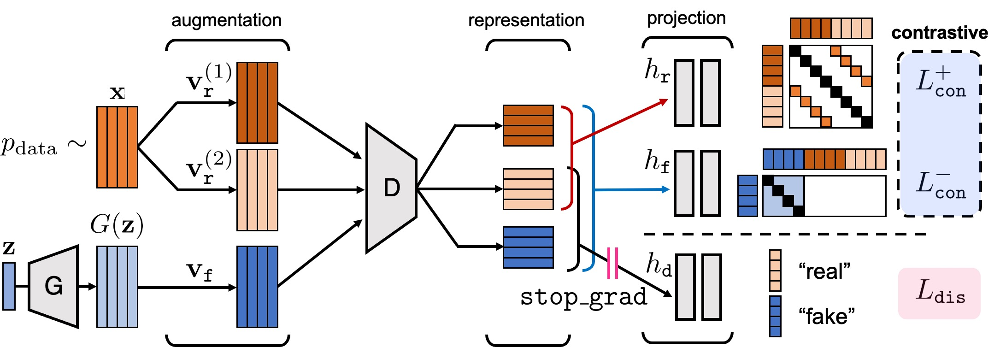

# Training GANs with Stronger Augmentations via Contrastive Discriminator (ICLR 2021)

This repository contains the code for reproducing the paper
**"Training GANs with Stronger Augmentations via Contrastive Discriminator"** 
by [Jongheon Jeong](https://sites.google.com/view/jongheonj) and [Jinwoo Shin](http://alinlab.kaist.ac.kr/shin.html). 

**TL;DR**: *We propose a novel discriminator of GAN showing that contrastive representation 
learning, e.g., SimCLR, and GAN can benefit each other when they are jointly trained.* 


*Qualitative comparison of unconditional generations from GANs on high-resoultion, yet limited-sized 
datasets of AFHQ-Dog (4739 samples), AFHQ-Cat (5153 samples) and AFHQ-Wild (4738 samples) datasets.*


## Overview



*An overview of Contrastive Discriminator (ContraD).
The representation of ContraD is not learned from the discriminator loss (L_dis), 
but from two contrastive losses (L+_con and L-_con), each is for the real and fake samples, respectively.
The actual discriminator that minimizes L_dis is simply a 2-layer MLP head upon the learned contrastive representation.*

## Dependencies

Currently, the following environment has been confirmed to run the code:
* `python >= 3.6`
* `pytorch >= 1.6.0` (See [https://pytorch.org/](https://pytorch.org/) for the detailed installation)
* `tensorflow-gpu == 1.14.0` to run `test_tf_inception.py` for FID/IS evaluations
* Other requirements can be found in `environment.yml` (for conda users) or `environment_pip.txt` (for pip users)
```
#### Install dependencies via conda.
# The file also includes `pytorch`, `tensorflow-gpu=1.14`, and `cudatoolkit=10.1`.
# You may have to set the correct version of `cudatoolkit` compatible to your system.
# This command creates a new conda environment named `contrad`.
conda env create -f environment.yml

#### Install dependencies via pip.
# It assumes `pytorch` and `tensorflow-gpu` are already installed in the current environment.
pip install -r requirements_pip.txt
```

### Preparing datasets

By default, the code assumes that all the datasets are placed under `data/`. 
You can change this path by setting the `$DATA_DIR` environment variable.

**CIFAR-10/100** can be automatically downloaded by running any of the provided training scripts.   

**CelebA-HQ-128**:
1. Download the [CelebA-HQ dataset](https://github.com/switchablenorms/CelebAMask-HQ) and extract it under `$DATA_DIR`.
2. Run [`third_party/preprocess_celeba_hq.py`](third_party/preprocess_celeba_hq.py) to resize and split the 1024x1024 images 
   in `$DATA_DIR/CelebAMask-HQ/CelebA-HQ-img`:
   ```
   python third_party/preprocess_celeba_hq.py
   ```

**AFHQ datasets**:
1. Download the [AFHQ dataset](https://github.com/clovaai/stargan-v2/blob/master/README.md#animal-faces-hq-dataset-afhq) and extract it under `$DATA_DIR`. 
2. One has to reorganize the directories in `$DATA_DIR/afhq` to make it compatible with
   [`torchvision.datasets.ImageFolder`](https://pytorch.org/vision/0.8/datasets.html#torchvision.datasets.ImageFolder).
   Please refer the detailed file structure provided in below.

The structure of `$DATA_DIR` should be roughly like as follows:   
```
$DATA_DIR
├── cifar-10-batches-py   # CIFAR-10
├── cifar-100-python      # CIFAR-100
├── CelebAMask-HQ         # CelebA-HQ-128
│   ├── CelebA-128-split  # Resized to 128x128 from `CelebA-HQ-img`
│   │   ├── train
│   │   │   └── images
│   │   │       ├── 0.jpg
│   │   │       └── ...
│   │   └── test
│   ├── CelebA-HQ-img     # Original 1024x1024 images
│   ├── CelebA-HQ-to-CelebA-mapping.txt
│   └── README.txt
└── afhq                  # AFHQ datasets
    ├── cat
    │   ├── train
    │   │   └── images
    │   │       ├── flickr_cat_00xxxx.jpg
    │   │       └── ...
    │   └── val
    ├── dog
    └── wild
```

## Scripts

### Training Scripts

We provide training scripts to reproduce the results in `train_*.py`, as listed in what follows:

| File | Description |
| ------ | ------ |
| [train_gan.py](train_gan.py) |  Train a GAN model other than StyleGAN2. DistributedDataParallel supported. |
| [train_stylegan2.py](train_stylegan2.py) | Train a StyleGAN2 model. It additionally implements the details of StyleGAN2 training, e.g., R1 regularization and EMA. DataParallel supported. |
| [train_stylegan2_contraD.py](train_stylegan2_contraD.py) | Training script optimized for StyleGAN2 + ContraD. It runs faster especially on high-resolution datasets, e.g., 512x512 AFHQ. DataParallel supported. |

The samples below demonstrate how to run each script to train GANs with ContraD.
More instructions to reproduce our experiments, e.g., other baselines, can be found in [`EXPERIMENTS.md`](EXPERIMENTS.md).
One can modify `CUDA_VISIBLE_DEVICES` to further specify GPU number(s) to work on.

```
# SNDCGAN + ContraD on CIFAR-10
CUDA_VISIBLE_DEVICES=0 python train_gan.py configs/gan/cifar10/c10_b512.gin sndcgan \
--mode=contrad --aug=simclr --use_warmup

# StyleGAN2 + ContraD on CIFAR-10 - it is OK to simply use `train_stylegan2.py` even with ContraD
python train_stylegan2.py configs/gan/stylegan2/c10_style64.gin stylegan2 \
--mode=contrad --aug=simclr --lbd_r1=0.1 --no_lazy --halflife_k=1000 --use_warmup

# Nevertheless, StyleGAN2 + ContraD can be trained more efficiently with `train_stylegan2_contraD.py` 
python train_stylegan2_contraD.py configs/gan/stylegan2/afhq_dog_style64.gin stylegan2_512 \
--mode=contrad --aug=simclr_hq --lbd_r1=0.5 --halflife_k=20 --use_warmup \
--evaluate_every=5000 --n_eval_avg=1 --no_gif 
```

### Testing Scripts

* The script [test_gan_sample.py](test_gan_sample.py) generates and saves random samples from 
  a pre-trained generator model into `*.jpg` files. For example,
  ```
  CUDA_VISIBLE_DEVICES=0 python test_gan_sample.py PATH/TO/G.pt sndcgan --n_samples=10000
  ```
  will load the generator stored at `PATH/TO/G.pt`, generate `n_samples=10000` samples from it,
  and save them under `PATH/TO/samples_*/`.

* The script [test_gan_sample_cddls.py](test_gan_sample_cddls.py) additionally takes the discriminator, and 
  a linear evaluation head obtained from `test_lineval.py` to perform class-conditional cDDLS. For example,
  ```
  CUDA_VISIBLE_DEVICES=0 python test_gan_sample_cddls.py LOGDIR PATH/TO/LINEAR.pth.tar sndcgan
  ```
  will load G and D stored in `LOGDIR`, the linear head stored at `PATH/TO/LINEAR.pth.tar`,
  and save the generated samples from cDDLS under `LOGDIR/samples_cDDLS_*/`.

* The script [test_lineval.py](test_lineval.py) performs linear evaluation for a given 
  pre-trained discriminator model stored at `model_path`:
  ```
  CUDA_VISIBLE_DEVICES=0 python test_lineval.py PATH/TO/D.pt sndcgan
  ```

* The script [test_tf_inception.py](test_tf_inception.py) computes Fréchet Inception distance (FID) and
  Inception score (IS) with TensorFlow backend using the original code of FID available at https://github.com/bioinf-jku/TTUR.
  `tensorflow-gpu <= 1.14.0` is required to run this script. It takes a directory of generated samples 
  (e.g., via `test_gan_sample.py`) and an `.npz` of pre-computed statistics:
  ```
  python test_tf_inception.py PATH/TO/GENERATED/IMAGES/ PATH/TO/STATS.npz --n_imgs=10000 --gpu=0 --verbose
  ```
  A pre-computed statistics file per dataset can be either found in http://bioinf.jku.at/research/ttur/, 
  or manually computed - you can refer [`third_party/tf/examples`](third_party/tf/examples) for the sample scripts to this end.
  

## Citation
```
@inproceedings{jeong2021contrad,
  title={Training {GAN}s with Stronger Augmentations via Contrastive Discriminator},
  author={Jongheon Jeong and Jinwoo Shin},
  booktitle={International Conference on Learning Representations},
  year={2021},
  url={https://openreview.net/forum?id=eo6U4CAwVmg}
}
```
